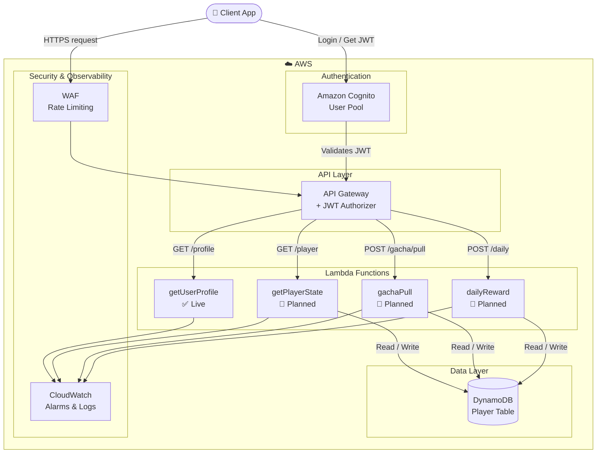

# Gacha Backend Security Project

> A simulated mobile game backend built to demonstrate real-world AWS cloud security — not a game, but the kind of backend attackers actually target.


---

## What This Is

Most security projects explain attacks in theory. This one builds the actual target system — a gacha game backend — and then demonstrates how to break it and defend it using AWS-native controls.

The backend handles user auth, player state, and game actions (gacha pulls, daily rewards). Every component is chosen because it mirrors a real attack surface: IDOR vulnerabilities, token replay, API abuse, and business logic attacks.

---

## Architecture



| Layer | Service | Purpose |
|---|---|---|
| Auth | Amazon Cognito | User pool, OAuth 2.0, JWT issuance |
| API | API Gateway (HTTP) | JWT authorizer, route management |
| Logic | AWS Lambda (Python) | Serverless game logic |
| Data | DynamoDB | Player state storage |
| Security | WAF + CloudWatch | Rate limiting, abuse detection |

---

## Security Concepts Demonstrated

### Built
- **JWT validation** — API Gateway verifies signature, issuer, audience, and expiry on every request
- **Auth vs AuthZ** — Cognito handles authentication; Lambda enforces authorization logic
- **OAuth 2.0 flows** — Authorization Code Grant vs Implicit Grant (and why Implicit is weaker)

### In Progress
- **IDOR prevention** — Ensuring users can only access their own player data
- **Token replay defense** — Detecting and blocking replayed valid tokens
- **Rate limiting** — API throttling + WAF rules to stop automated abuse
- **Business logic attacks** — Preventing duplicate daily reward claims, gacha bot detection

---

## Tech Stack

- **Cloud:** AWS (Cognito, API Gateway, Lambda, DynamoDB, CloudWatch, WAF)
- **Language:** Python 3.12
- **Auth:** OAuth 2.0, JWT (RS256)
- **IaC:** AWS CDK *(planned)*

---

## Project Progress

### Phase 1 — Authentication Layer ✅
- [x] Cognito User Pool with email sign-in
- [x] OAuth 2.0 Authorization Code Grant flow
- [x] HTTP API Gateway with JWT Authorizer
- [x] Protected `GET /profile` route (Lambda)
- [x] JWT validation: signature, issuer, audience, expiry

### Phase 2 — Player State (In Progress)
- [ ] DynamoDB Player table (userId, gems, stamina, inventory)
- [ ] `GET /player` — fetch player state
- [ ] `POST /gacha/pull` — gacha logic with abuse prevention
- [ ] `POST /daily` — daily reward with idempotency check

### Phase 3 — Security Controls
- [ ] API Gateway throttling + WAF rate limiting
- [ ] CloudWatch alarms for abuse detection
- [ ] IDOR attack demo + fix
- [ ] CDK infrastructure as code

---

## API Endpoints

| Method | Route | Auth | Status |
|---|---|---|---|
| GET | `/profile` | JWT required | ✅ Live |
| GET | `/player` | JWT required | 🔧 Planned |
| POST | `/gacha/pull` | JWT required | 🔧 Planned |
| POST | `/daily` | JWT required | 🔧 Planned |

---

## Key Security Design Decisions

**Why Cognito instead of custom auth?**
AWS Cognito handles token rotation, MFA, and brute force protection out of the box. Rolling custom auth for a security-focused project would be ironic.

**Why JWT at the API Gateway layer?**
Validating tokens at the gateway means Lambda never executes on unauthenticated requests. Zero unauthorized compute cost, and a clear separation of concerns.

**Why serverless for a security demo?**
Lambda's per-invocation model makes rate limiting and abuse detection more visible — you can directly observe how many times a function is called, by whom, and trigger alarms on anomalies via CloudWatch.

---

## Setup

> Prerequisites: AWS account, AWS CLI configured, Python 3.12

```bash
# Clone the repo
git clone https://github.com/menchikatsubentou/gachafakebackend.git
cd gachafakebackend

# Deploy Lambda functions (manual via AWS Console for now)
# CDK deployment coming in Phase 3
```

Full setup guide coming with CDK implementation.

---

## What I Learned

Building this has made the difference between knowing security concepts and understanding why they exist. Configuring JWT validation at the gateway layer isn't hard — but reasoning through what happens when you skip it (any unauthenticated client hits Lambda, runs code, costs money) made the design decision actually make sense.

---

## Roadmap

- [ ] Complete Phase 2 game logic with DynamoDB
- [ ] Demonstrate IDOR attack + fix with video/screenshots
- [ ] Add WAF rules and CloudWatch dashboards
- [ ] Deploy full stack with AWS CDK
- [ ] Write attack scenario walkthroughs for each security concept
