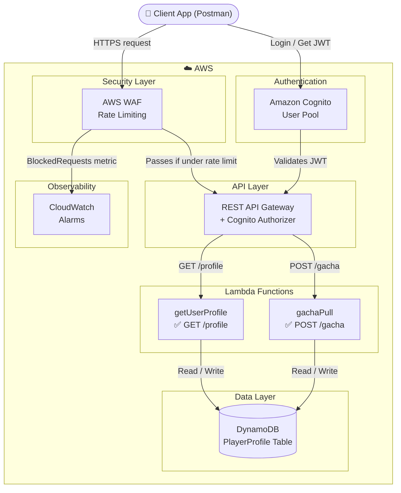

# Gacha Backend Security Project

> A simulated mobile game backend built to demonstrate real-world AWS cloud security skills.

---

## What This Is

This project is aimed to build a simple gacha backend and then demonstrate how to break it and defend it using AWS native controls..

The backend handles user authentication, player state, and game actions (gacha pulls). Every component is chosen because it mirrors a real attack surface: IDOR vulnerabilities, token replay, API abuse, and business logic attacks.

📄 **Full writeup (with screenshots):** [Google Docs](https://docs.google.com/document/d/1hNqS2u34GIlzdbPa0w67J0EPErJ82YEISMYcwPndvg4/edit?tab=t.0#heading=h.j81g4m49vl4a)

---

## Architecture

| Layer | Service | Purpose |
|---|---|---|
| Auth | Amazon Cognito | User pool, OAuth 2.0, JWT issuance |
| Security | AWS WAF | Rate limiting, bot protection |
| API | REST API Gateway | Cognito authorizer, route management |
| Logic | AWS Lambda (Python) | Serverless game logic |
| Data | DynamoDB | Player state storage |
| Observability | CloudWatch | Alarm on blocked requests |

---

## Security Concepts Demonstrated

### Authentication & Authorization
- **JWT validation** — REST API Gateway verifies signature, issuer, audience, and expiry on every request before Lambda executes
- **Auth vs AuthZ** — Cognito handles authentication; Lambda enforces authorization by extracting identity from the verified JWT, never from client-supplied parameters
- **OAuth 2.0 flows** — Authorization Code Grant vs Implicit Grant and why Implicit is weaker (token exposed in browser URL)

### Attack Defense
- **IDOR prevention** — userId is always extracted from the signed JWT token, never from URL parameters. A second test user demonstrates the attack fails — the attacker receives their own data regardless of what userId they pass in the request
- **API abuse / business logic attacks** — WAF rate-based rule blocks IPs exceeding 100 requests per 5 minutes, preventing automated gacha farming
- **Token replay mitigation** — Cognito JWT tokens expire after 1 hour; tokens are transmitted over HTTPS only

### AWS Security Design
- **Principle of least privilege** — `getUserProfile` Lambda has `DynamoDBReadOnlyAccess`; `gachaPull` Lambda has `DynamoDBFullAccess` — each function gets only what it needs
- **Defense in depth** — WAF blocks at the network edge before requests reach API Gateway; Cognito authorizer blocks before Lambda executes; Lambda enforces identity from JWT
- **Observability** — CloudWatch alarm triggers when WAF blocked requests exceed threshold, enabling real-time abuse detection

---

## Tech Stack

- **Cloud:** AWS (Cognito, REST API Gateway, Lambda, DynamoDB, WAF, CloudWatch, IAM)
- **Language:** Python 3.12
- **Auth:** OAuth 2.0, JWT (RS256)
- **Testing:** Postman, Postman Collection Runner

---

## API Endpoints

| Method | Route | Auth | Status |
|---|---|---|---|
| GET | `/profile` | JWT required | ✅ Live |
| POST | `/gacha` | JWT required | ✅ Live |

---

## Project Progress

### Phase 1 — Authentication Layer ✅
- [x] Cognito User Pool with email sign-in
- [x] OAuth 2.0 Implicit Grant for testing, Authorization Code Grant discussion
- [x] REST API Gateway with native Cognito Authorizer
- [x] Protected `GET /profile` route
- [x] JWT validation: signature, issuer, audience, expiry

### Phase 2 — Player State & Game Logic ✅
- [x] DynamoDB PlayerProfile table (userId partition key, gems, stamina, inventory)
- [x] `GET /profile` — fetch player state from DynamoDB
- [x] `POST /gacha` — gem deduction + inventory update via `list_append`
- [x] IAM least privilege per Lambda function
- [x] Migrated from HTTP API to REST API Gateway for WAF support

### Phase 3 — Security Controls ✅
- [x] AWS WAF Web ACL attached to REST API Gateway (dev stage)
- [x] Rate-based rule: 100 requests per 5 minutes per IP → Block
- [x] WAF tested with Postman Collection Runner (150 iterations, 0ms delay)
- [x] CloudWatch alarm on WAF `BlockedRequests` metric → SNS email notification
- [x] IDOR attack demonstrated and defended with second test user

---

## Key Security Design Decisions

**Why REST API Gateway instead of HTTP API?**
HTTP API does not support WAF attachment. Migrating to REST API was necessary to enable the security layer. The migration also changed the event structure Lambda receives — HTTP API wraps claims under `jwt.claims`, REST API exposes them directly under `authorizer.claims`.

**Why Cognito instead of custom auth?**
Cognito handles token rotation, signature verification, and expiry out of the box. Rolling custom JWT validation for a security-focused project would undermine the point — and introduce new attack surfaces.

**Why JWT validation at the API Gateway layer?**
Validating tokens at the gateway means Lambda never executes on unauthenticated requests. Zero unauthorized compute cost, clear separation of concerns, and a consistent enforcement point regardless of which Lambda function is called.

**Why WAF instead of just API Gateway throttling?**
WAF blocks at the network edge before requests reach API Gateway. It also provides sampled request logs showing exactly what was blocked and why, and can be extended with IP blocklists, geo-blocking, and SQL injection rules without touching application code.

**Why DynamoDB instead of RDS?**
Player lookups are simple key-value operations — one userId maps to one player record. DynamoDB's always-free tier (25GB storage, 25 read/write units) makes it cost-free for a demo project. RDS requires an always-on instance, costing money even when idle.

---

## What I Learned

Building this made the difference between knowing security concepts and understanding why they exist:

- Configuring JWT validation at the gateway layer isn't hard but reasoning through what happens when you skip it (any unauthenticated client hits Lambda, runs code, costs money) made the design decision actually make sense
- IDOR protection isn't about adding validation logic, it's about never trusting client-supplied identifiers in the first place
- WAF counts all requests regardless of authorization status, failed auth attempts still increment the rate limit counter, which affects how you calibrate thresholds
- HTTP API and REST API Gateway have meaningfully different event structures for Cognito claims, a subtle difference that causes silent KeyErrors if not caught

---

## Author

Daniel Hor Jung Wey — AWS Cloud Practitioner | SAA in progress
